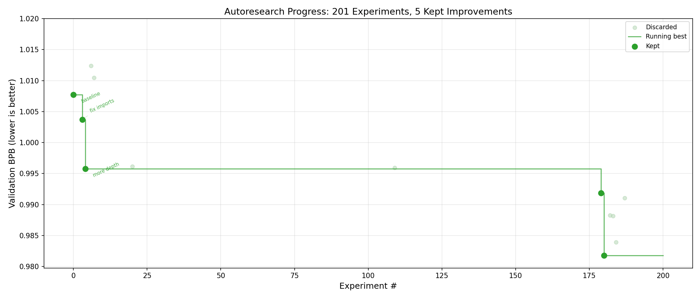
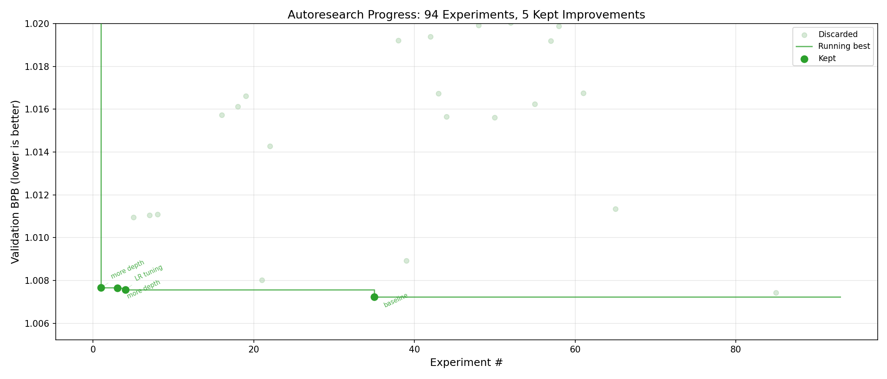
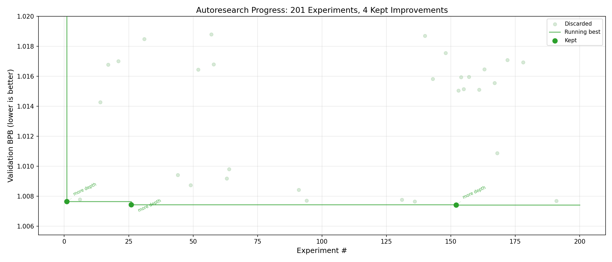
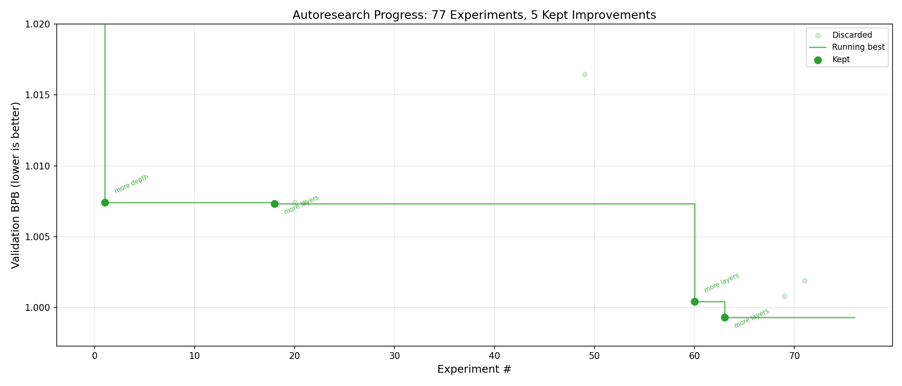

# Autoresearch on Ocean Network

Autonomous ML research agent that iteratively improves a GPT pretraining script to minimize validation bits-per-byte (val_bpb). Inspired by [Karpathy's autoresearch](https://github.com/karpathy/autoresearch).

The key difference: everything runs **inside a single Docker container** on [Ocean](https://dashboard.oncompute.ai/) GPU nodes with a **local open-source LLM** — no API keys needed. The current setup uses a single H200 GPU with **Qwen3-14B** (unquantized bf16, ~28GB) — small enough to share the GPU with training at 0.7 temperature for maximum exploration throughput.

## From Karpathy's Experiment to Ocean

Karpathy's [autoresearch](https://github.com/karpathy/autoresearch) uses the Claude API to drive the agent loop. We adapted it to run fully self-contained on Ocean Network:

1. **Local LLM instead of API** — Replaced Claude API calls with **Qwen3-14B** served via **vLLM** (unquantized bf16, ~28GB). No API keys, no per-token costs.
2. **Single GPU** — vLLM takes 25% of H200 VRAM (~35GB) for the agent LLM, training uses the rest. Previous variants with Qwen3-32B-AWQ and Qwen3.5-27B are preserved as `algo_qwen3-32B.py` and `algo_qwen3.5-27B.py`.
3. **Single Docker container** — Everything packaged in one container: PyTorch, vLLM, Flash Attention 3, data pipeline. Ocean runs it on remote GPU nodes via a symlink to `/app/data/transformations/algorithm`.
4. **Self-bootstrapping data** — `prepare.py` downloads HuggingFace data shards and trains a BPE tokenizer at container startup, so nothing needs to persist between runs.

> **Alternative**: You can also use the Claude API (or any LLM API) from inside the container by passing an API key as an environment variable. Stronger model, but adds cost and network dependency.

A few clicks give you an autonomous ML researcher that runs for hours on H200 GPUs, costs nothing beyond the compute rental, and produces a `results.json` with the full experiment history and winning code.

## How It Works

1. **Data prep** — Downloads HuggingFace data shards, trains a BPE tokenizer (`prepare.py`)
2. **Load agent LLM** — Qwen3-14B via vLLM (~28GB VRAM, stays resident, shares GPU with training)
3. **Baseline run** — Runs the original `train.py` on GPU 1 (5-min training budget), records val_bpb
4. **Agent loop** (up to 200 iterations):
   - LLM reads experiment history + current best `train.py`
   - Generates a hypothesis + complete new `train.py`
   - Syntax check → train (5 min) → evaluate val_bpb
   - If improved: keep. If not: revert to best.
   - `results.json` saved after every iteration

The user extracts `results["best"]["train_py"]` to get the winning code.

## Files

| File | Description |
|------|-------------|
| `algo.py` | Core agent loop — Qwen3-14B, single H200, 0.7 temp, LLM and training share GPU |
| `algo_qwen3-32B.py` | Single-GPU variant using Qwen3-32B-AWQ |
| `algo_qwen3.5-27B.py` | 2×H200 variant using Qwen3.5-27B (one GPU per role) |
| `train.py` | GPT pretraining script (the file the agent modifies) |
| `prepare.py` | Data download, tokenizer, dataloader, evaluation (read-only) |
| `program.md` | Instructions for the agent LLM |
| `Dockerfile` | Container build (CUDA 12.8, Python, PyTorch, vLLM) |
| `plot_progress.py` | Generate progress charts from results |

## Usage

1. Go to [dashboard.oncompute.ai](https://dashboard.oncompute.ai/)
2. Select a **single H200 GPU** environment (or 2×H200 with `algo_qwen3.5-27B.py`)
3. Configure the job and add payment
4. Open the **Ocean Orchestrator** in VS Code / your editor
5. Open this directory in the orchestrator and run the job — the container builds and executes `algo.py` autonomously
6. Download `results.json` from the outputs when complete

To plot results after a run:
```bash
python plot_progress.py path/to/results.json progress.png
```

## Results

The first three runs used the single-GPU setup (Qwen3-32B-AWQ on one H200). The last run used the 2×H200 setup with Qwen3.5-27B.

### Qwen3-32B-AWQ — 0.7 Temperature (First Run)



- **Baseline**: 1.0077 val_bpb
- **Best**: 0.9818 val_bpb (2.6% improvement)
- **201 iterations** over 5.5 hours, 29 successful runs (86% crash rate)
- Key improvements: increased model depth (8→10 layers), late-stage hyperparameter tuning

### Qwen3-32B-AWQ — 0.5 Temperature, 6 Hours



- **Baseline**: 1.0227 val_bpb
- **Best**: 1.0072 val_bpb (1.5% improvement)
- **94 iterations** over 6 hours, 36 successful runs (62% crash rate)
- Lower crash rate than 0.7 temp, but much less improvement — the agent converged early and plateaued

### Qwen3-32B-AWQ — 0.5 Temperature, 12 Hours



- **Baseline**: 1.0215 val_bpb
- **Best**: 1.0074 val_bpb (1.4% improvement)
- **201 iterations** over 12 hours, 52 successful runs (74% crash rate)
- Double the runtime of the first run but worse results — the agent got stuck and couldn't escape the local minimum

### Qwen3.5-27B — 2×H200, ~12 Hours



- **Baseline**: 1.0251 val_bpb
- **Best**: 0.9993 val_bpb (2.5% improvement)
- **77 iterations** over ~12 hours, 38 successful runs (51% crash rate)
- Key improvements: model depth (more layers), concentrated in the second half of the run

### Takeaway

Lower temperature (0.5 vs 0.7) reduces the crash rate (62-74% vs 86%) but produces significantly worse results. The more "creative" 0.7 temperature generates more broken code, but the successful mutations are bolder and lead to real architectural improvements (e.g. deeper models). At 0.5 temp the agent plays it safe, converges early to ~1.007 val_bpb, and stalls — even with 12 hours of compute it can't match what 0.7 temp achieved in 5.5 hours.

Switching from the quantized Qwen3-32B-AWQ (single GPU) to the full Qwen3.5-27B (2×H200) didn't help — the larger model ran fewer experiments in the same time (77 vs 201), had a lower crash rate (51% vs 86%), but couldn't beat the 0.9818 val_bpb that Qwen3-32B at 0.7 temp reached. The reduced throughput likely offset any quality gains from the stronger model.
